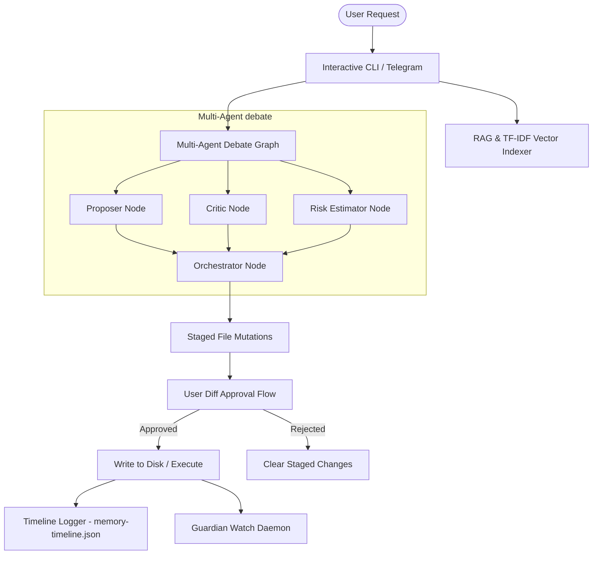

# 🐾 GhoshClaw AI OS

An agentic, multi-agent software development co-pilot designed to run locally on your system, index your codebases, and act as a secure, sandboxed assistant. It integrates an interactive CLI dashboard and a Telegram Bot for remote debugging, security auditing, and live code modification.

---

## 🚀 Quick Start & Installation

### 1. Global Installation
Install **GhoshClaw** globally on your system using npm or bun:
```bash
npm install -g sahitya-ghoshclaw
```
*(Alternatively: `bun install -g sahitya-ghoshclaw`)*

### 2. Onboarding Setup
Before running the agent, configure your local API keys (only OpenRouter or Groq is required):
```bash
ghoshclaw init
```
* **Security Guard**: Your credentials are stored **only** on your local machine in `~/.ghoshclaw/.env` and are never sent to external servers.

### 3. Wake Up the Agent
Navigate to any of your coding projects and launch the interactive co-pilot dashboard:
```bash
ghoshclaw wakeup
```

---

## 🛠️ How to Use & Examples

Once you start `ghoshclaw wakeup`, choose one of the launching modes:

### 🖥️ Interactive CLI Sub-Modes
* **Agent-Mode**: Give the agent a task (e.g., *"Add error handling to auth.ts"*). A multi-agent consensus graph will design, criticize, and draft a diff. You review the diff and approve it before it touches your disk.
* **Plan-Mode**: Define a complex goal. The planner will generate a detailed step-by-step implementation plan. Select the steps you want to execute, and watch the agent complete them sequentially.
* **Ask-Mode**: Ask questions about your codebase (e.g., *"How does the router handle sessions?"*). GhoshClaw will search your code using a local RAG vector engine and explain the logic.
* **🧠 Multi-Agent Debate**: Runs LangGraph proposer, critic, and risk estimator nodes in a debate loop to draft bulletproof code modifications.
* **📜 Memory-Timeline**: View a tree of all past file edits, shell commands executed, and the AI reasoning/risk scores associated with them.
* **🛡️ Background-Guardian**: Recursively watches your codebase. On save, it checks for secrets, runs a typecheck, and notifies you of bugs. Press `F` to auto-fix compilation errors.
* **⏮️ Semantic-Rollback**: Revert specific changes based on user intent (e.g., *"Rollback auth edits but keep UI modifications"*).
* **🏛️ Architecture-Engine**: Scan the repo to get a maturity rating (0-100%), modular health heatmap, and a refactoring roadmap.

---

## 📱 Telegram Remote Control Integration
You can optionally configure a Telegram Bot to remote control your development workspace:
* `/ask <question>` — Ask the agent questions about your codebase from your phone.
* `/agent <task>` — Prompt the agent to modify code remote. It drafts the diff and sends a Telegraf message with **`📋 Show Diff`**, **`✅ Accept All`**, or **`❌ Reject`** inline buttons.
* `/plan <goal>` — Generate a multi-step plan, select steps on your phone screen, and execute.
* **Live Alerts & Auto-Fix**: If the Background Guardian detects a compilation error while you are coding, it pings your Telegram. Tapping the **`🔧 AI Auto-Fix`** button runs the debugger on your computer and repairs the code instantly!

---

## 🏛️ Local Agent Architecture



### 1. Vector Embed Context (RAG Engine)
When you ask a question or request a modification, GhoshClaw uses a fast **TF-IDF scoring vector indexer** located at `modes/agent/rag-engine.ts`. 
* On startup, it performs a fast metadata file diff using a disk cache file (`rag-cache.json`).
* It parses your code files into semantic chunks, indexing only new/modified files in under 2ms.
* It retrieves the most relevant snippets to feed into the LLM system instructions, grounding the AI's answers directly in your local code.

### 2. Multi-Agent Consensus Loop
Instead of relying on a single AI prompt, GhoshClaw runs a LangGraph pipeline:
1. **Research Agent**: Pulls AST structure, dependencies, and RAG context.
2. **Proposer Agent**: Drafts the code solution.
3. **Critic Agent**: Reviews code style, edge cases, and safety.
4. **Risk Estimator**: Scores confidence and labels risk (Low/Medium/High).
5. **Orchestrator**: Outputs the final unified patch and reasoning.

---

## ⚙️ Tech Stack & Open Source
GhoshClaw is built on top of robust, modern open-source web technologies:
* **Runtime**: [Bun](https://bun.sh/) (Fast bundler, compiler, and TS runner).
* **AI Engine**: [Vercel AI SDK](https://sdk.vercel.ai/) & [LangGraph JS](https://github.com/langchain-ai/langgraphjs).
* **CLI UX**: [Clack Prompts](https://github.com/natemoo-re/clack), [Chalk](https://github.com/chalk/chalk), [Ora](https://github.com/sindresorhus/ora), and [Boxen](https://github.com/sindresorhus/boxen).
* **Telegram Bot**: [Telegraf](https://github.com/telegraf/telegraf).

---

## 📄 License
This project is open source and distributed under the **MIT License**. Feel free to fork, customize, and build on top of it!